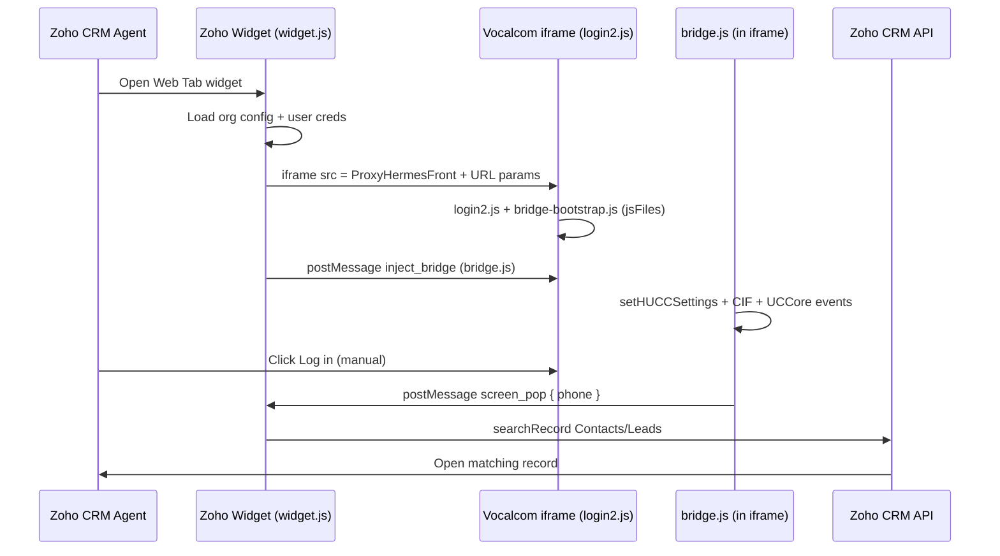

# Odoo ↔ Zoho HUCC Connector Architecture

This document maps the Vocalcom HUCC integration patterns from the Odoo POC to this Zoho Sigma extension.

## High-level flow



## Component mapping

| Odoo (reference) | Zoho (this project) | Notes |
|------------------|---------------------|-------|
| `ir.config_parameter` (global settings) | `plugin-manifest.json` → `config[]` + Sigma org variables | `front_url`, `loader_url`, `proxy_config`, `config_code`, `customer_id` |
| `res.users` fields (`hucc_login`, `hucc_password`, `hucc_station`) | `localStorage` keyed by Zoho user ID | Can be replaced with Zoho user custom fields |
| OWL toolbar + iframe (`hucc_toolbar.xml`) | `widget.html` + iframe | Web Tab widget placement |
| `/vocalcom_hucc/prefill.js` / `login2.js` loader | CDN `login2.js` via `HUCCLoader` param | Zoho widget is HTTPS — use CDN loader directly |
| `/vocalcom_hucc/bootstrap.js` | `bridge-bootstrap.js` via `jsFiles` | Runs inside iframe; CIF stub + inject listener |
| `/vocalcom_hucc/loader.js` (full bridge) | `bridge.js` injected via postMessage | HUCC events → parent screen-pop |
| `hucc_service.screenPop()` → `res.partner` search | `widget.js` → `ZOHO.CRM.API.searchRecord` | Contacts + Leads by phone |
| `postMessage` source `odoo_hucc` / `vocalcom_hucc` | `zoho_hucc` / `vocalcom_hucc` | Same protocol, renamed parent source |
| Manual login (`auto_login=False`) | Agent clicks **Log in** in iframe | Credentials pre-filled via URL + `setHUCCSettings` |
| Dual-session / `recoverSessionOnce` | **Not implemented** | Single iframe, no auto-reload loops |

## URL parameters (iframe)

Exact casing matches Vocalcom expectations:

| Param | Source |
|-------|--------|
| `HUCCLoader` | Org config — CDN `login2.js` |
| `CustomerID` | Org config — tenant ID (demo: `10`) |
| `proxyConfig` | Org config |
| `configCode` | Org config — ask Vocalcom for Zoho-specific code |
| `userId` | Per-user login (demo: `1013`) |
| `Password` | Per-user password (demo: `123456`) |
| `agentStation` | Per-user station (demo: `86659`, editable in widget) |
| `jsFiles` | Extension-hosted `bridge-bootstrap.js` absolute URL |

## Screen-pop contract

Bridge posts to parent:

```json
{
  "source": "vocalcom_hucc",
  "type": "screen_pop",
  "phone": "+966500000010",
  "direction": "inbound",
  "channel": "call",
  "call_id": "…"
}
```

Widget searches Zoho **Contacts** then **Leads** by phone and opens the first match (or first of many).

## Click-to-call

- Widget listens for `tel:` link clicks in the CRM page context where supported.
- Sends `{ source: "zoho_hucc", type: "dial", phone }` into iframe.
- Bridge calls `Vocalcom.UCCore.Telephony.manualCall(phone)`.

## Config code

| Environment | Value |
|-------------|-------|
| Demo (Dynamics-style POC) | `HUCCPluginConfiguration360` |
| Production Zoho | **`HUCCPluginConfigurationZoho`** (placeholder — request from Vocalcom) |

## Softphone popups

The iframe uses `allow-popups` sandbox permission. Vocalcom may open auxiliary windows for WebRTC/softphone. If a **second CTI master window** appears, close it — only one session should remain (same guidance as Odoo POC).

## Files

```
extension/
├── plugin-manifest.json    # Sigma manifest (CRM webtab widget + org config)
├── config/settings.json    # Default demo values (documentation)
└── app/
    ├── widget.html         # Shell UI
    ├── widget.js           # Zoho SDK init, iframe URL, screen-pop
    ├── widget.css
    ├── bridge-bootstrap.js # In-iframe bootstrap (jsFiles)
    └── bridge.js           # Full HUCC event bridge (injected)
```
